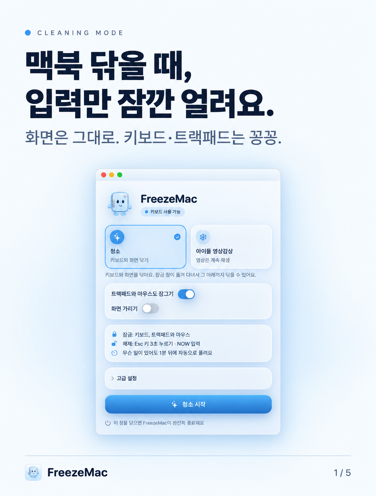
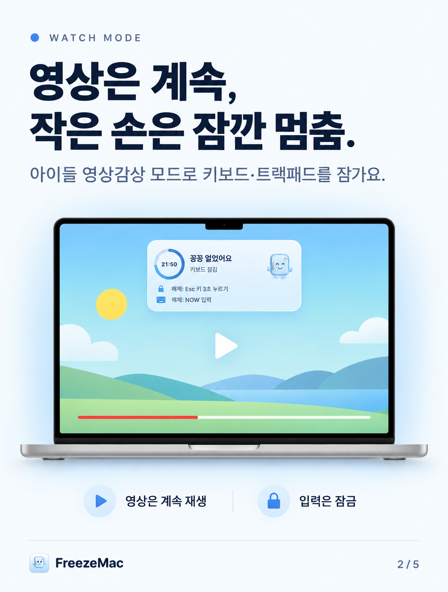
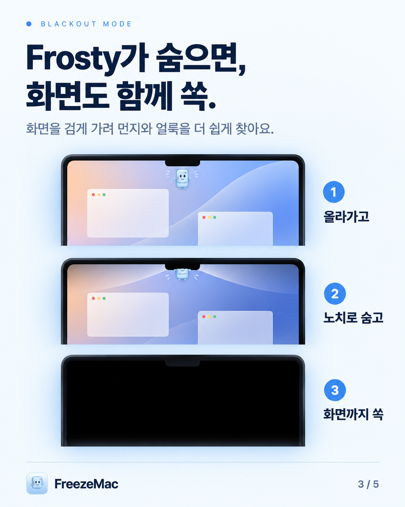
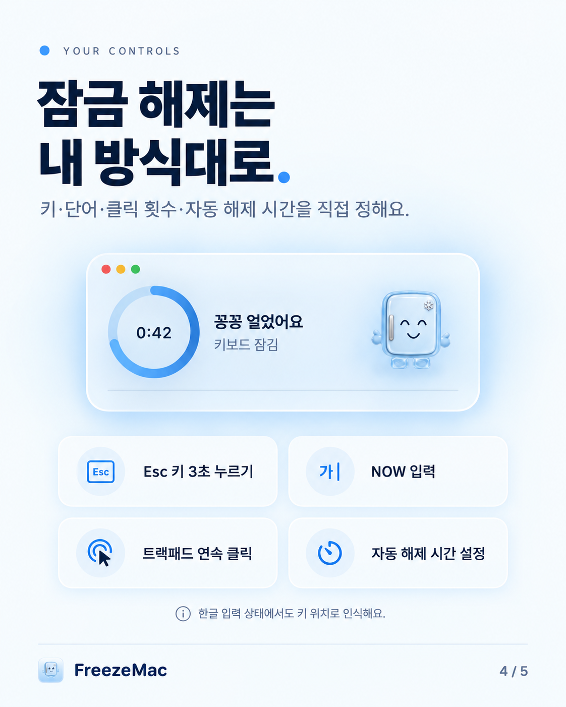
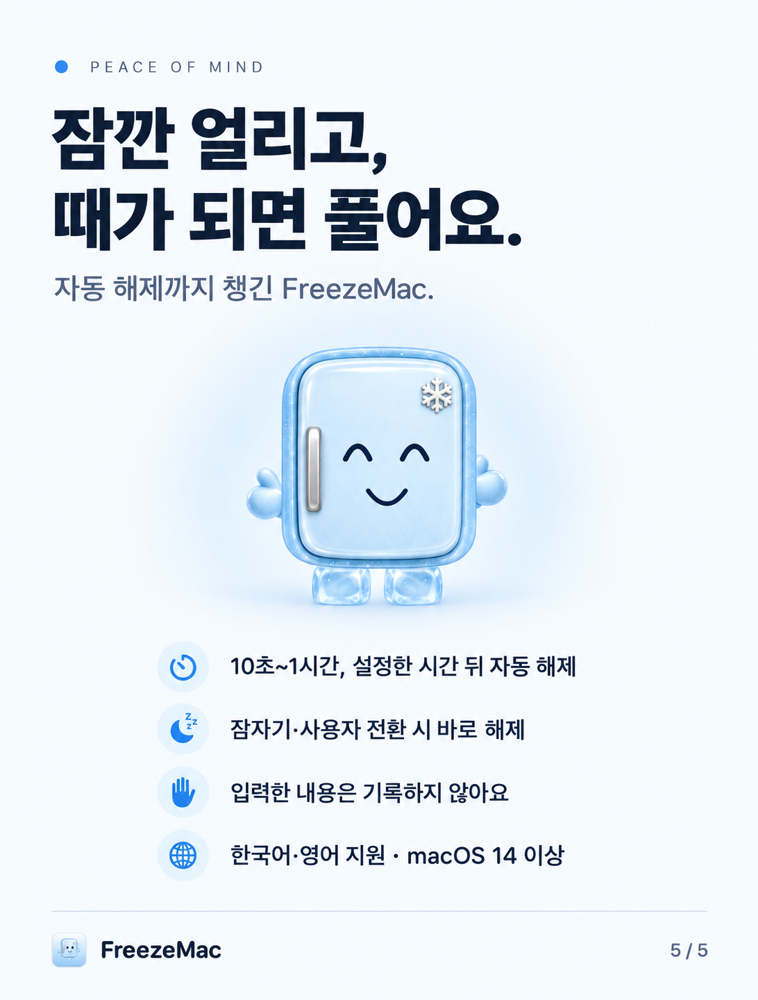

# FreezeMac 🧊

맥북을 닦거나 아이에게 영상을 보여줄 때, **키보드와 트랙패드 입력만 꽁꽁 얼려주는** macOS 앱이에요.
화면과 영상은 그대로 두고 입력만 막아요.

*A macOS app that freezes keyboard and trackpad input while you clean your MacBook or let a child watch a video. The screen keeps working; only input is locked.*

<p align="center">
  
  
  
</p>
<p align="center">
  
  
</p>

## 기능

- **두 가지 모드**
  - **청소:** 키보드·트랙패드 잠금. 잠금 창이 화면을 옮겨 다녀서 창 아래까지 닦을 수 있어요.
  - **아이들 영상감상:** 영상은 계속 재생, 입력만 잠금. 시간은 분 단위로 정해요.
- **화면 꺼짐(청소용):** 마스코트 Frosty가 아래에서 기어올라와 노치로 날아가면, 화면이 함께 빨려 들어가며 까맣게 꺼져요. 외장 모니터도 고를 수 있어요.
- **해제 방법을 직접 설정:** 특정 키 길게 누르기, 단어 입력(기본 `NOW`), 트랙패드 연속 클릭. 단어는 키 위치로 확인해서 한글 입력 상태에서도 동작해요.
- **자동 해제는 항상 켜져 있어요:** 10초~1시간 중 정한 시간이 지나면 무슨 일이 있어도 풀려요. 잠자기나 사용자 전환 때도 바로 풀려요.
- **한국어·영어 지원:** 맥 언어 설정을 따라가요.

## 설치

1. [Releases](../../releases)에서 `FreezeMac.zip`을 내려받아 압축을 풀고 `FreezeMac.app`을 응용 프로그램 폴더로 옮겨요.
2. 아직 Apple 서명·공증을 받지 않은 앱이라, 처음 열 때 **오른쪽 클릭 → 열기**로 실행해요.
   그래도 막히면 시스템 설정 › 개인정보 보호 및 보안 아래쪽의 **"그래도 열기"**를 눌러요.
3. 앱 안내에 따라 **시스템 설정 › 개인정보 보호 및 보안 › 손쉬운 사용**에서 FreezeMac을 허용해요.
   입력을 막으려면 이 권한이 꼭 필요해요. FreezeMac은 입력 내용을 기록하거나 저장하지 않아요.

**요구 사항:** macOS 14 Sonoma 이상, Apple Silicon(M1 이후) Mac.

## 직접 빌드하기

Xcode 16 이상이 필요해요.

```sh
xcodebuild -project FreezeMac.xcodeproj -scheme FreezeMac -configuration Release \
  -derivedDataPath .derivedData CODE_SIGNING_ALLOWED=NO build
open .derivedData/Build/Products/Release/FreezeMac.app
```

서명 없이 빌드하면 빌드할 때마다 서명이 바뀌어서, 손쉬운 사용 권한을 다시 켜야 할 수 있어요.
목록에 FreezeMac이 있는데 동작하지 않으면 `−` 버튼으로 지우고 다시 추가해 주세요.

## 알아두세요

- 전원 버튼, Touch ID, 덮개 닫기 같은 하드웨어 동작은 막지 않아요.
- 세 손가락 스와이프 같은 시스템 제스처는 일부 통과할 수 있어요.

## 크레딧

입력 차단의 바탕은 MIT 라이선스로 공개된 [CleanKeys](https://github.com/zsomborn0/CleanKeys)의 코드를 고쳐 쓴 거예요. 자세한 내용은 [THIRD-PARTY-NOTICES.md](THIRD-PARTY-NOTICES.md)를 봐 주세요.
